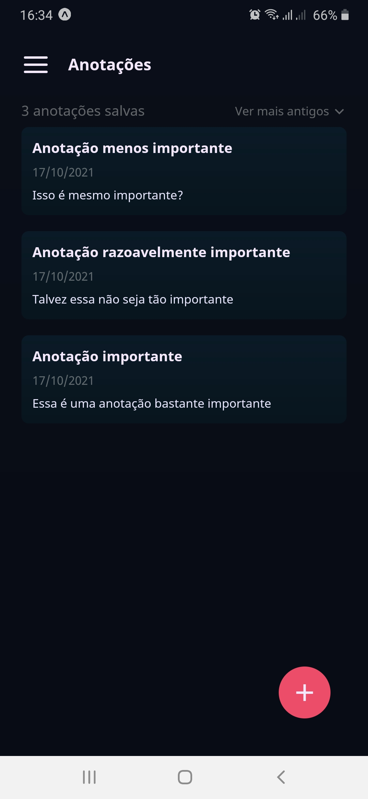

<h1 align="center">
	
</h1>

	
    

    
    

<h1 align="center">Notes</h1>

Aplicativo mobile desenvolvido em React Native com Expo. Funciona como um bloco de notas tradicional, com a possibilidade de criar, visualizar, editar e deletar anotações. Além disso, possui uma aba de notas especiais que funcionam como post-its, para anotações mais curtas e objetivas.

<h4>Projeto base finalizado 🚀</h4>

<h3>Funcionalidades</h3>

- [x] Criação, visualização, edição e deleção de notas.
- [x] Criação, visualização, edição e deleção de post-its.
- [x] Filtrar anotações e post-its por "mais antigos" ou "mais recentes".
- [x] Escolha de cores de fundo para os post-its.
- [x] Armazenamento de dados no dispositivo do usuário com Async Storage.
- [x] Perguntar por criação de rascunhos ao clicar em voltar.
- [x] Perguntar se deseja salvar as alterações feitas em notas já existentes.
- [x] Configurações para ativar ou desativar as funções de rascunhos e de alterações feitas.

<h2 align="center">Teste a aplicação instalando-a na sua máquina</h2>

Primeiramente, você vai precisar ter o Node e o NPM instalados na sua máquina (<a href="https://nodejs.org/en/download/">você pode baixá-los aqui</a>) , assim como o Yarn e o Expo. 

- Você pode instalar o <strong>yarn</strong> da seguinte forma: acesse o terminal do seu Sistema e execute o seguinte comando:

		npm install --global yarn
- Após isso você pode verificar se a instalação funcionou, executando
		
		yarn --version
	
- Você pode instalar o <strong>expo</strong> da seguinte forma: acesse o terminal do seu Sistema e execute o seguinte comando:
		
		npm install expo-cli --global

- Após isso você pode verificar se a instalação funcionou, executando

		expo --version

Obs: um erro comum na instalação dessas ferramentas <strong>no Windows</strong> está relacionado à políticas de segurança do Windows Powershell. Caso enfrente esse erro, você pode ver formas de resolvê-lo <a href="https://pt.stackoverflow.com/questions/220078/o-que-significa-o-erro-execu%C3%A7%C3%A3o-de-scripts-foi-desabilitada-neste-sistema">aqui</a> 

Após isso, clone o repositório na pasta de sua preferência

- O projeto apresenta uma variada gama de bibliotecas e dependências, as quais você pode instalar usando o terminal. Todas são necessárias para o pleno funcionamento do app. Acesse a linha de comando de seu S.O, navegue até a pasta do Notes e instale as bibliotecas usando o seguinte comando:

		yarn install

- Após todo o processo de instalação, você pode executar o projeto via servidor do expo, utilizando o seguinte comando:

		expo start

	Agora, apenas aguarde enquanto o Expo abre a janela da aplicação para que você possa vê-la funcionando. 
	-   Caso esteja usando um dispositivo físico, baixe o app do Expo na loja de aplicativos do seu celular (Android ou IOS) e então use-o para scannear o código QR que aparece na janela aberta na sua máquina.
	-   Caso esteja usando um emulador, abra-o e clique em  **Run on Android device/emulator.**
	
<h2>🛠 Tecnologias</h2>

As ferramentas utilizadas para o desenvolvimento da aplicação foram:

- React Native com Expo
- TypeScript

### Autor
---

<a href="https://github.com/0horaa">
 
  
 <b>Sérgio Gabriel</b></a> 🚀 
<a href="https://twitter.com/0hora_">Twitter</a> 
